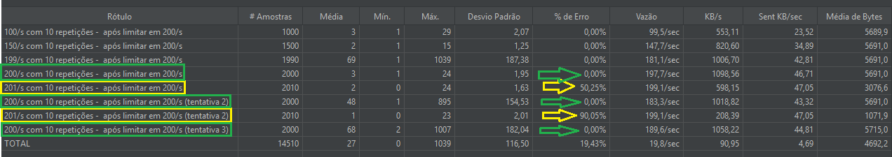
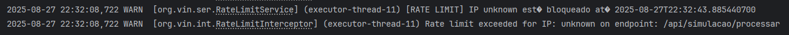
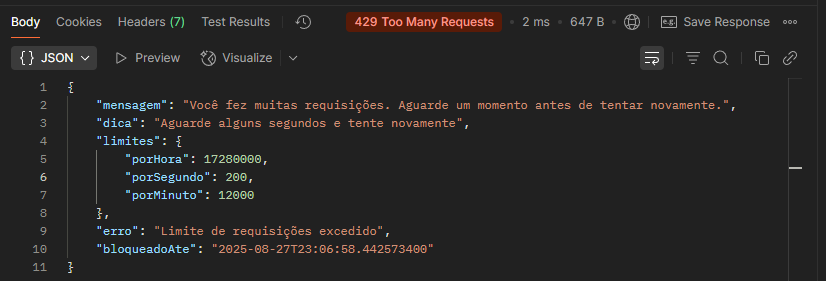
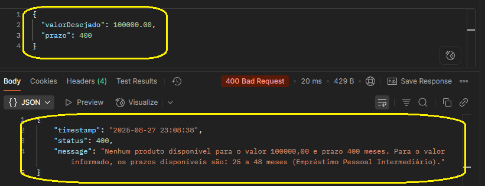

# 📌 API Empréstimo Agora - [Hackathon Caixa 1ª fase]

💳 **Simulador de Empréstimos** desenvolvido em **Java 17 + Quarkus**

## ⚡ Execução Rápida

### 🔹 Opção 1 — Docker Compose (✅ Recomendado)

```bash
docker-compose up -d --build 
```

### 🔹 Opção 2 — Build e Execução Manual

```bash
# Build
./mvnw clean package -DskipTests

# Execução
java -jar target/*-runner.jar
```
---
## 🌐 Links de acesso

- **API** → http://localhost:8080
- **Swagger UI** → http://localhost:8080/q/swagger-ui
- **collection** → [API Emprestimo Agora.postman_collection.json](API%20Emprestimo%20Agora.postman_collection.json)
---
## 🚀 Diferenciais Implementados

### 🔒 Rate Limiting

- Definido após testes de carga com JMeter para obter a taxa ideal de requests por segundo, protegendo a aplicação sem limitar demais o uso.
- **Limites**: 200 req/s, 12.000 req/min, 17.280.000 req/hora.
- Bloqueio temporário inteligente para abusos.
---
### Aqui podemos observar os testes de carga após implementar o rate limit.

---
---
### O usuário é bloqueado ao ultrapassar o limite de requisições por período

---
---
### Recebe erro 429 com detalhes dos limites de requisições ao usuário.

---
---
### Mensagens de erro personalizadas

---
---
### 📁 Arquivo .env

- O projeto utiliza arquivo `.env` para configuração de variáveis de ambiente
---

- ### Testes unitários
---
### 🧠 Cache Inteligente
- Cache de produtos com invalidação automática.
- Cache de listagens com paginação otimizada.
---
- ## 🔄 Processamento assíncrono
- Envio de eventos para o Azure Event Hub, e
- Persistência das métricas no Postgres local em segundo plano.
---

### 📊 Endpoints Extras

- Busca de produtos.
- Busca de transação por ID.
- Parâmetro opcional na busca paginada para valores referentes ao sistema SAC ou PRICE.
- Parâmetro opcional de data no endpoint de telemetria.
---

## ⚙️ Funcionalidades Obrigatórias (Core)

### 🗄️ Banco de Dados

- Pool otimizado (min: 2, max: 20 conexões).
- **Multi-Database**:
  - PostgreSQL (produção).
  - SQL Server (integrações).
- Backup persistente com volumes Docker.

### ✅ Validação personalizada

- Bean Validation com mensagens customizadas.
- DTOs tipados → validação + serialização automática.
- Exception Handling centralizado com respostas detalhadas.

### 🩺 Observabilidade e Resiliência

- Health Checks em todos os controllers.
- Transações com rollback automático.
- OpenTelemetry → rastreamento distribuído.


### 🛠️ Desenvolvimento Amigável

- Scripts SQL de dados de teste → permite desenvolver offline.
- Uso do arquivo .env para variáveis de ambiente (mais seguro e fácil troca de variável)
- Properties por ambiente (prod e dev).
- Swagger/OpenAPI completo com exemplos práticos.