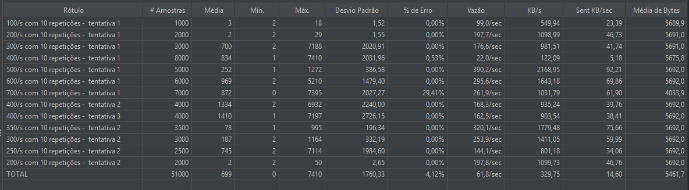

# Teste de Imagem

Este é um arquivo de teste para demonstrar como uma imagem fica renderizada em Markdown.

## Imagem de Teste

Abaixo está a imagem localizada na pasta `imagens`:

### Informações sobre a imagem:
- **Localização**: `./imagens/imagem teste.png`
- **Formato**: PNG
- **Descrição**: Imagem de teste do projeto

---

*Nota: O caminho da imagem usa codificação URL (%20) para o espaço no nome do arquivo.*